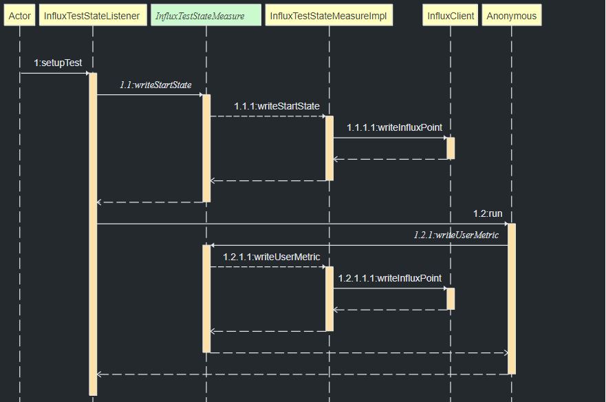
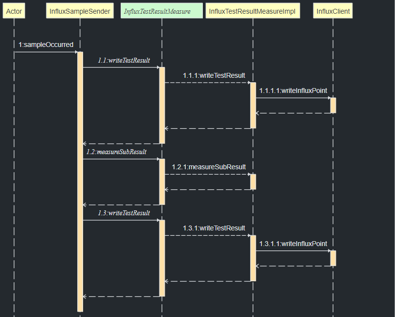
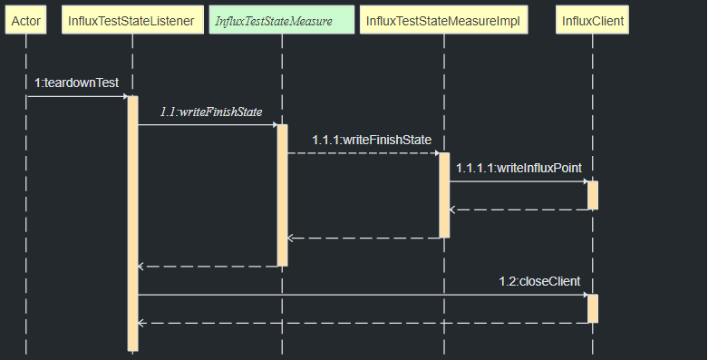

# Influx Jmeter Remote Test

Jmeter has a [sender mode](https://jmeter.apache.org/usermanual/remote-test.html#sendermode) which allows loading 
customized SampleSender. This plugin makes use of that feature and enables the Jmeter remote server (slave machine) 
to send the Test Result directly to Influx Database, in order to provide real-time test data. After sending to Influx, 
Test Result will be sent back to the master machine using Batch Mode.


## Installation

Install the plugin to `${JMETER_HOME}/lib/ext` on master and each slave machine

## Configuration

> Make sure to enable [distributed testing](https://jmeter.apache.org/usermanual/jmeter_distributed_testing_step_by_step.html)
> before continue

```properties
# Mandatory properties
# Use this InfluxSampleSender to send test result to Influx Database before send it to master machine.
# Exclude this property will disable this plugin.
mode=com.github.vanduc2514.plugins.samplers.InfluxSampleSender

# Test Specific properties
# Set the name of the thread groups (comma separated value), which should be excluded from the result sent to Influx Database
# By default, the excluded groups is ["setUp Thread Group", "tearDown Thread Group"]
excluded.thread.groups=

# Test Specific properties
# Set the option to save error response to true/false
# By default, this plugin never save error response to reduce workload
measure.save.error=

# Test Specific properties
# Set the option to save sub result from sample result 
# By default, this property is set to true
measure.sub.result=

# Test Specific properties
# The test name that appears in Influx
test.name=

# Test Specific properties
# The run id that appears in Influx
test.runId=

# Influx properties
# The host name of Influx database, whether it is a resolved name or an Ip address
# Example: localhost
influxdb.hostname=

# Influx properties
# The port of Influx database
# Example: 8086
influxdb.port=

# Influx properties
# Raw bucket token string generated from Influx
influxdb.token=

# Influx properties
# The organization name of Influx database
influxdb.organization=

# Influx properties
# The bucket name from Influx database
influxdb.bucket=

# Influx properties
# Enable ssl (https) for connection to Influx
# Setting this to blank or ignore it will use the default http connection
influxdb.ssl.enable=

# Optimization properties
# The time for each virtual user metric sent to Influx in second
# Default value is 1 second
measure.user.interval=

# Optimization properties
# The size of the executor used for sending virtual user metric in multi thread environment.
# Default value is 10 threads available in pool
measure.user.pool=

# Optimization properties
# The size of the batching result sent to Influx Database. 
# Default is 1000 results
write.batch=

# Optimization properties
# The time for each request sent to Influx in millisecond
# Default value is 1000 millisecond
write.flush.interval=

# Optimization properties
# The limitation of the buffer used for sending result to Influx Database
# Default is 10000
write.buffer.limit=
```

### Usage

Execute the test plan from the master machine with `-q` option and the `.properties` file contains above properties. 
For more information, refers to [Override Jmeter Properties](https://jmeter.apache.org/usermanual/get-started.html#override).

For example:

```shell
jmeter -n -r -t Example-Apache-Jmeter-Plan.jmx -q influx.properties

```

### Development

This plugin is an extension of the existing Batch mode found in Jmeter Remote testing. It is developed based on Custom 
implementation of [Sender mode](https://jmeter.apache.org/usermanual/remote-test.html#sendermode).



At test start, master Jmeter machine invokes ``setupTest()`` from ``InfluxTestStateListener`` to write **Start State** 
Point to Influx using ``InfluxTestStateMeasure``. Then it creates a ``ScheduledExecutorService`` to gradually write the 
**User Metric** Point to Influx. After that, the test plan is sent to remote Jmeter machines for execution.



When remote Jmeter machine receives a sample from the test case, it invokes ``sampleOcurred()`` from the custom implementation
``InfluxSampleSender``. Then``InfluxTestResultMeasure`` writes **Test Result** Point to Influx. If ``measure sub result`` 
is enabled, this sender will populate the sub result from the sample, and also writes the result to Influx.

After that this ``InfluxSampleSender`` invokes ``sampleOcurred()`` in the super ``BatchModeSender`` to send sample back
to master Jmeter machine. If ``master_send_result`` is enabled, then the master will send a write request to Influx 
using the same ``InfluxTestResultMeasure`` above.



At test end, master Jmeter machine invokes ``teardownTest()`` from ``InfluxTestStateListener`` and writes **Finish State**
Point to Influx.

See:
[InfluxDB Java client 2](https://github.com/influxdata/influxdb-client-java)

Thanks [@mderevyankoaqa](https://github.com/mderevyankoaqa), the author of
[jmeter-influxdb2-listener-plugin](https://github.com/mderevyankoaqa/jmeter-influxdb2-listener-plugin),
you inspired me developing this.

Thanks [@Vanco](https://github.com/Vanco) for the cool [Sequence Diagram Plugin](https://github.com/Vanco/SequencePlugin)
